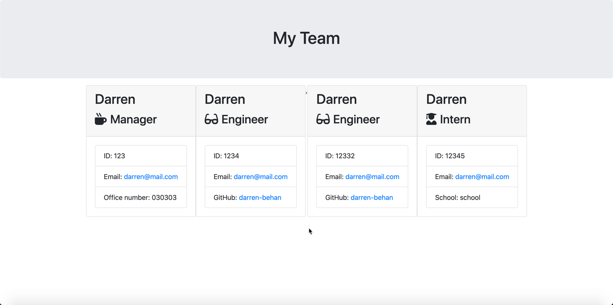

# template-engine

      

# Welcome to Template Engine 👋

## Description

📚 A `Node CLI application` that takes in information about employees and generates an HTML webpage that displays summaries for each employee

## Table of Contents 🗂

* [Description](#Description)
* [Installation](#Installation)
* [Usage](#Usage)
* [License](#License)
* [Version](#Version)
* [Contributing](#Contributing)
* [Tests](#Tests)
* [Questions](#Questions)

## Installation

⚙️ use `Clone with HTTPS` and run `git clone + the HTTPS link` to install locally. Then, run `npm i`

## Usage

🚨 run `node index.js` in the terminal, answer the prompts and a file called `blueprint.md` will generate containing the information required for your `README.md` file

View live demo <a href="https://drive.google.com/file/d/10TWXtHeJLKdq1aYwhcRDBxuKnYrvw4DL/view">here</a>

## License

🖋 

This app is not using a license

## Version

℣ 

## Contributing

👩‍💻 create a fork and submit a PR for review

## Tests

🧪 run `npm run test` in the directory

## Questions

❓ Feel free to create an issue for review

🌍 https://github.com/darren-behan

📧 me at darrenbehan@hotmail.com

